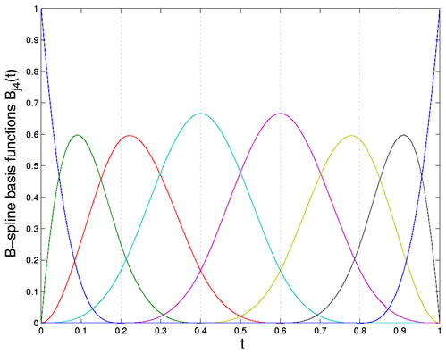
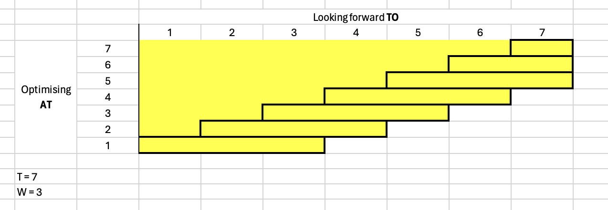

# Dynamic Labor Supply - Guaranteed Income

This folder directory contains code to generate results for Section 6.3 of Vivalt et al. (2024) https://www.nber.org/papers/w32719   
This Read is the technical note for the model  
Author: Leonard Chun Kit Dai  

## Characterising the Optimisation Problem

Economic agents in the model solve a dynamic optimisation problem, maximising utility by choosing the paths of consumption, labor supply and asset. We use the canonical model that aggregates the utilities from consumption and disutility from working across the lifetime/ horizon $T$ of the agent. 

With constraints on asset accumulation, non-negative consumption and maximum working hours, the agent solves the following optimisation problem. 

$`\max_{\{c_t, l_t, A_{t+1}\}_1^{T}} \sum_{t=1}^T \delta^{t-1}[u(c_t - \gamma_c) - B v(l_t)]`$  

$`
\begin{aligned}
s.t. &&&\\
&A_{t+1} & = & (1+r)[A_t + w_tl_t - c_t + I_t + TR_t] \\
&A_{T+1} & = & 0 \\
&c_t & \geq & 0 \\
&l_t & \leq & \gamma_l\\
\end{aligned}`$

where $t$ denotes the time period, $c_t$ and $l_t$ are consumption and labor supply in hours at time $t$. $B$ is a constant scaling parameter. $u(.)$ represents the utility from consumption and $v(.)$ represents the disutility from working. Following Cesarini (2017)and Imbens (2001), we assume a Stone-Geary utility function where $\gamma_c$ is a fixed subsistence level of consumption, below which utility is infinitely negative. $\gamma_h$ is the maximum number of hours the economic agent can work within a period. 

We assume that the agent has a CRRA utility function for consumption.

$`
u(c_t - \gamma_c) = \frac{(c_t-\gamma_c)^{1-\sigma}}{1-\sigma}
`$

$\sigma$ is the risk aversion parameter.

The disutility from labor is represented by 

$`
v(l_t) = \frac{\eta}{1+\eta} l_t^{\frac{1+\eta}{\eta}}
`$

where $\eta$ is the Frisch elasticity, conceptually defined as $\eta = \frac{\partial l}{\partial w} \frac{w}{l}$

Defining $V_t(A_t)$ be the maximum utility the agent can achieve, given $A_t$.

And let

$`
U(c_t, l_t) = u(c_t) - B v(l_t)
`$

We get

$`
Vt(A_t) = \sum_{t=1}^T \delta^{t-1}[U(c_t, l_t)]
`$

---

## Solving the Optimisation Problem

Solving the optimisation problem involves two distinct parts. First, find the Value Functions for all the periods from the first period to the Terminal period $\{V_t(A_t)\}_{t=1}^{T}$ . Second, using the value function to find the consumption, labor and asset paths. As will explained in greater detail below, the first part solves the problem backward from the terminal period and the second part find the optimal forward from the first period. 

### Bellman Equation

By expanding the equation for $V_t(A_t)$ and substituting $V_{t+1}(A_{t+1})$ into $V_t(A_t)$, we obtain the Bellman equation:

$`
V_t(A_t) = \max_{c_t, l_t, A_{t+1}} U(c_t, l_t) + \delta \mathbb E[V_{t+1}(A_{t+1})]
`$

which breaks down the problem to a much simpler subproblem from solving $\{c_t, l_t, A_{t+1}\}_{t = 1}^{T}$

to solving $\{c_t, l_t, A_{t+1}\}$ at time $t$ only. 

### Closed-form solution for $c_t, l_t$ given $A_{t+1}$

To further simplify the problem, take $A_{t+1}$ as given. We can use Lagrangian method to find the closed-form solution for $c_t, l_t$ With the following FOC conditions: 

$`
\begin{aligned}
c_t: & u'(c_t^*) - \lambda_t (1+r)   & = & 0 \\
l_t: & -Bv'(l_t^*) + \lambda_t (1+r)w_t& = & 0 \\
\lambda_t: & (1+r)(A_t + w_t l_t^* - c_t^* + I_t + TR_t)& = & 0 \\
\end{aligned}
`$

### Approximating $V_t(A_t)$ -  Standard Method: Spline Interpolation

Assuming that that $V_{t+1}(A_{t+1})$ is known. With the Bellman Equation, the agent can maximise $V_t(A_t = A_t)$ by finding an optimal $A_{t+1}$ and its associated consumption and labor bundle $\{c_t^*, l_t^*\}$. Do this across the domain for $A_t$, we can get $V_t(A_t)$. 
Trying to find the maximum value across all possible values of $A_t$ is computationally infeasible. Therefore, a spline approximation method is used. Conceptually, any efficient approximation method can be used, but the literature has largely converged to using splines approximation or the “collocation method”

Spline approximation fits multiple low-degree polynomials over small and overlapping subsets of the input values. Instead of fitting a high-degree polynomial over the entire function. The low-degree polynomials are called basis functions $\phi_j(.)$. Each basis function has a non-zero range over a small subset of the domain (i.e. the entire Asset space) and the levels of the basis function are controlled by the coefficients $\alpha_j$. An approximated value of $V_t(A_t = A_T)$ is calculated by adding together all the basis functions’ values at $A_t$ scaled by the coefficients.

- $V_t(A_t) \approx \sum_{j=1}^N  \alpha_{j,t} \phi_j (A_t) \Leftrightarrow \Phi \pmb{\alpha}_t \approx \pmb{V}_t$

In the economic literature, it’s common to solve for `N` nodes for `N` spline functions, and then the coefficients $\{\alpha_{j,t}\}_{j = 1}^N$ can be solved by $\pmb{\alpha}_t = \Phi^{-1} \pmb{V}_t$

By computing $V_t(A_{n})$   where $A_n \in \{A_1, A_2, …, A_{\text{N-nodes}}\}$ we can find $\pmb{\alpha}_t$ and thus approximate the function $V_t(A_t)$

  

Example of basis functions

### Approximating $V_t(A_t)$ -  Preferred Method: Smoothing  Splines

In practice, we found the standard method to solve`N` nodes for `N` spline functions to be unreliable. The functional form is too sensitive to the choice of knots and it is very prone to over fitting. Moreover, due to the backward solving nature of the problem (explained in more detail below) small fitting errors for values in between the knots are magnified  in subsequent approximation. Illustration 1 below shows the utility function approximated using the standard method. Illustration 2 shows the preferred smoothing splines approximation method we used. 

  

To quickly grasp the smoothing splines, it is important to know 1. it is possible to get coefficients of splines $\mathbb{\hat{\alpha}}$ by regression (commonly referred to regression splines) 2. we can apply regularisation techniques on regression, commonly Ridge and LASSO

**Regression Splines:** 

One can obtain coefficients for the basis functions my method of least squares by minimising the criterion:

$`
\sum_{i=1}^{N} (V_t(A_i) -  \sum_{k=1}^K  \alpha_{k,t} \phi_k (A_i))^2
`$

or more succintly

$`
\|V_t-\Phi\mathbb{\alpha}_t\|_2^2
`$

and $\hat{\mathbb{\alpha}}_t$ can be solved by 

$`
\hat{\mathbb{\alpha}}_t = (\Phi^{T}\Phi)^{-1}\Phi^T V_t
`$

**Smoothing Splines:**

Smoothing splines add regularisation terms to the standard regression splines. It might be useful to be reminded that the minimisation criterion for ridge regression is $\| \mathbb{y} - \mathbb{X} \beta\|_2^2 + \lambda \| \beta \|_2^2$p

Similarly, smoothing splines minimises

$`
\| V_t - \mathbb{\Phi}\mathbb{\alpha}_t\| + \lambda \mathbb{\alpha}_t^T \Omega \mathbb{\alpha}_t
`$

where $\lambda \geq 0$ is the regularisation parameter, and $\Omega$ is the penalty matrix.  In the case of cubic splines, it is constructed by the summation of the Cartesian product of the second derivatives of basis function evaluated at each node(please refer to [Reference](https://www.stat.cmu.edu/~ryantibs/advmethods/notes/smoothspline.pdf)  for more details)

In short, smoothing splines returns a different set of coefficients $\mathbb{\alpha}_t^{\text{smoothing}}$ that gives an approximation of $V_t(A_t)$ is more well-behaved. 

[Reference](https://www.stat.cmu.edu/~ryantibs/advmethods/notes/smoothspline.pdf) 

### Solving Backward

Approximating $V_t(A_t)$ depends on knowing $V_{t+1}(A_{t+1})$. In a finite horizon model, we assume that $A_{T+1} = 0$ (i.e. the agent exhaust all its resources at the final period and do not have unrepaid debt), $c_{T+1} = l_{T+1} = 0$. Then, $V_{T+1}(A_{T+1} = 0)$ can be calculated easily and $V_t(A_t) \forall t \in \{1, 2, ..., T\}$ can be solve backward recursively.

### Choosing the path of consumption, labor and asset

Having a set of ${V_t(A_t)}_{t = 1}^T$ functions, the agent can find the optimal path of consumption, labor, and assets given his current stock of assets. At each period $t$ with asset $A_t$ the agent maximizes $V_t(A_t = A_t)$ by finding an optimal $A_{t+1}$ and its corresponding consumption and labor supply bundle. In the next period, the $A_{t+1}$ from the previous period is updated to be current period asset $A_t$ and a corresponding consumption and labor bundle is chosen. Do this recursively for all the periods, the paths of optimal consumption, labor and asset are derived. 

### Guaranteed Income Transfer

Guaranteed Income Transfer changes the budget constraints of the agents; therefore, agent receiving Guaranteed Income Transfer would have different $V_t(A_t)$ compared to those who do not. In our model, there are three sets of Value functions: 1. $\{V_t(A_t)\}_{t = 1}^T$ used by the agent not in the experiment. 2. $\{V_t^{control}(A_t)\}_{t = 1}^T$ used by agent in the control group receiving a transfer $50 per month. 3. $\{V_t^{treat}(A_t)\}_{t = 1}^T$ used by agent in the treatment group receiving $1000 per month. 

Note that bellman quation maximizes the **expected** utility from the next period. Meaning that the timing of the knowledge about future transfer is important. 

$`
V_t(A_t) = \max_{c_t, l_t, A_{t+1}} U(c_t, l_t) + \delta \mathbb E[V_{t+1}(A_{t+1})]
`$

To be more concrete, If the agents know that he will receive the Guaranteed Income Transfer in period 10. From period 1 to period 9, his decisions, $V_t(A_t) \forall t\in \{1, 2, ..., 9\}$, $\mathbb E [V_{t+1}(A_{t+1})] \forall t\in \{1, 2, ..., 9\} = \textcolor{red}{\mathbb E} [V_{t}(A_{t})] \forall t\in \{2, 3, ..., \textcolor{red}{10}\}$  will be the same as another agent who will not receive the transfer. From period 10, the agent will have a different $V_t^{treat}(A_t)$

After the Guaranteed Income Transfer, the Value Functions $V_t(A_t)$ among the non-treated, control and treated agents are the same because the exogenous variables in the budget constraint $A_{t+1} = (1+r)(A_t - c_t + w_t l_t + It + T_t) \text{ where }T_t = 0$ are the same for all the groups. 

However, the chosen paths even after the end of Guaranteed Income Transfer would be different because different $A_t$s are picked by the the control and treatment group. 

---

## Quasi-Hyperbolic Discounting

  
We assume agent hyperbolic discounting. Meaning that agent has “present-bias”. We follow the standard literature of using Quasi-hyperbolic discounting to approximate hyperbolic function. 

Revisiting Standard Bellman:

*Let*

$`
S(c_t, l_t) = u(c_t) + B v(l_t)
`$

In the standard model: 

$`
\begin{aligned}
V_t(A_t) & = & S(c_t^*, l_t^*)
 & + & \delta S(c_{t+1}^*, l_{t+1}^*) & + & \delta^2 S(c_{t+2}^*, l_{t+2}^*)  & + & \delta^3 S(c_{t+2}^*, l_{t+2}^*) & + & ... \\

V_t(A_{t+1}) & = & & & S(c_t^*, l_t^*) & + & \delta S(c_{t+1}^*, l_{t+1}^*) & + & \delta^2 S(c_{t+2}^*, l_{t+2}^*) & + & ... \\

\end{aligned} 
`$

by substituting $V_t(A_{t+1})$ into $V_t(A_t)$ We have the bellman equation

$`
\begin{aligned}
V_t(A_t) = S(c_t^*, l_t^*) + \delta \mathbb E[V_{t+1}(A_{t+1})]
\end{aligned}
`$

With quasi-hyperbolic Discounting

**One period present-bias :** 

$`
\begin{aligned}
& V_t^{qhyp}(A_t) & = & S(c_t^*, l_t^*)
 & + & & \beta\delta S(c_{t+1}^*, l_{t+1}^*) & + & \beta \delta^2 S(c_{t+2}^*, l_{t+2}^*)  & + & \beta \delta^3 S(c_{t+2}^*, l_{t+2}^*) & + & ... &\\
\Leftrightarrow & V_t^{qhyp}(A_t) & = & S(c_t^*, l_t^*)
 & + & \beta \delta [ & S(c_{t+1}^*, l_{t+1}^*) & + & \delta S(c_{t+2}^*, l_{t+2}^*)  & + & \delta^2 S(c_{t+2}^*, l_{t+2}^*) & + & ... &]\\
\end{aligned} 
`$

Therefore, we can use the next period value function derived from **the standard model** $V_{t+1}(A_{t+1})$ to calculate the quasi-hyperbolic value function $V_t^{qhyp}(A_t)$

$`
\begin{aligned}
\Rightarrow & V_t^{qhyp}(A_t) & = &  S(c_t^*, l_t^*) & + & \beta \delta & \mathbb E[  V_{t+1}(A_{t+1})]
\end{aligned}
`$

**Multiple period present-bias:** 

It is customary for the literature to assume that agent suffer present bias for the in the first period. To extend the model, we can consider an alternative specification where agent faces present bias for the first $q$ periods. This characterisation is conceptually important as model could be “denominated” in different time frames e.g. monthly, quarterly, yearly. If the first model model agents’ decisions yearly and place a stronger discounting factor in the first year, it is only natural for a second model which model agents’ decision quarterly to place a “present-biased” discounting factor for the first 4 periods. 

To model this, consider a situation with 2 discount factor

$`
\text{discount factor} = \begin{cases}
\delta \beta, & \text{if } \ t \leq t + q +1 \\
\delta, & \text{if }  \ t > t + q +1\\
\end{cases}
`$

In the one-period model $q = 1$, and in a multi-period model $q$ is extended to some small $\tilde{t}$ 

e.g. $q = 1$ it is a yearly model, and 4 when it is a quarterly model

The Bellman for quasi-hyperbolic discounting would become

$`
\begin{aligned}
\Rightarrow & V_t^{qhyp}(A_t) & = &  \sum_{j = 1}^{q} & \beta^{j-1} \delta^{j-1} S(c_j^*, l_j^*) & + & \beta^{q} \delta^{q}  & \mathbb E[  V_{t + q}(A_{t + q})]
\end{aligned}
`$

Further examining $\sum_{j = 1}^{q} \beta^{j-1} \delta^{j-1} S(c_j^*, l_j^*)$

 Given $A_t$ and $A_{t + q}$

The problem can be solved using **Euler’s Equation,** recursive substitution of the budget constraint and FOC conditions 

$`
\begin{aligned}\text{\textit{Euler's Equation: }}  & u'(c_j^*) = \beta \delta (1+r) u'(c_{j+1}^*)\\\text{\textit{Budget Constraint: }} & A_{t + q} = (1+r) \Bigl\{[ (...) +w_{t+q-2} l_{t+q-2}^* - c_{t+q-2}^* + I_{t+q-2} + TR_{t+q-2}] +w_{t+q-1} l_{t+q-1}^* - c_{t+q-1}^* + I_{t+q-1} + TR_{t+q-1}\Bigr\}\\\text{\textit{FOC conditions}}: & u'(c_j^*) w_t = \beta \delta Bv'(l_j^*)\end{aligned}
`$

This sequence problem can be solved **analytically**

$`
\begin{aligned}
\text{given, } &\\
& u(c_j) & = & \frac{c_j^{1-\sigma}}{1-\sigma}\\
\text{\textit{Euler's euqation} implies,} &\\ & c_j & = & c_{j+1}[(1+r) \beta \delta]^{-\frac{1}{\sigma}}\\
\Leftrightarrow & c_{j+1} & = & c_j[(1+r) \beta \delta]^{\frac{1}{\sigma}}
\end{aligned}
`$

- Note, it’s also possible solve 2 dynamic programming one with $t \leq t + q$ and the other with $t > t+q$, but for small $q$ it make much more computation sense to solve the first part analytically

---

## Rolling Window

If the agent is myopic, the agent’s optimisation horizon would be shorter than $T$. We model this by assuming that the agent’s forward looking horizon is a rolling window. 

Mathematically, 

Agent has a horizon $t+W-1 \leq T$, where $W$ is the window length

Therefore at each period $t$,

The agent has look ahead to period $D_t = \min (t+W-1, T)$

$`
\max_{\{c_t, l_t, A_{t+1}\}_2^{D_t} }\sum_{t=1}^{D_t} \delta^{t-1}[u(c_t - \gamma_c) - B v(l_t)]
`$  

$`
\begin{aligned}
s.t. &&&\\
&A_{t+1} & = & (1+r)[A_t + w_tl_t - c_t + I_t + TR_t] \\
&c_t & \geq & 0 \\
&A_{D_t} & = & 0
\end{aligned}
`$

In the next period the agent the window shift forward and agent look ahead to period $D_{t+1} = \min (t+W, T)$ 

- Note that $A_{t+1}^{RW} \leq A_{t+1}^{std}$ because agents are looking forward to a shorter horizon, but if discount factor $\delta$ is small enough $A_{t+1}^{RW} \approx A_{t+1}^{std}$

  

At each t, 

the agent conceptually would solve $\{\pmb{a}\}_{t=t}^{D}$ then choses the optimal budule. 
note, however, that  $\{\pmb{a}\}_{t=t}^{D}$ is computationally equivalent to $\{\pmb{a}\}_{t=1}^{D}$ evaluating at $t=t$ 

Therefore, a collection of standard model with different terminal periods from $t=1$ is solved. 

i.e. solve $\{\{\pmb{a}\}_{t=1}^{fl}\}_{fl = W}^T$ , $fl$ is how much forward-looking form $t = 1$

- $fl$ is numerically identical to $D$
    
    (the yellow cells in the figure above)
    
- Although computationally expensive i.e. takes more than $\frac{T(T+1)}{2}$ times longer to solve than the standard model, it is still more efficient than trying to solve the model at every point where the agent needs to make a decision, and once the collection of $\{\{\pmb{a}\}_{t=1}^{fw}\}_{fw = 1}^T$is calculated, it can be expanded almost indifinately to to any number of windows lengths calculation points with minimal marginal computation cost

Using a window of 3 as an **illustrative example** (refer to the figure above), 

At $t=1$, the agent is forward looking to $fw =  1 + 3 -1 = 3$ meaning that the agent optimize its choices believing that he will exhaust his asset after $t=3$. Then the agent will maximize

$`
V_{1}^{W=3}(A_{1}) = \max_{c_1, l_1, A_2} W(c_1,l_1) + \delta \mathbb E[V_2^{fl=3}(A_2)]
`$

At $t=2$ the agent faces its $A_2$ choice from $t=1$ and forward looking to $fw =2+3-1 = 4$. Then the agen will maximize

$`
V_{2}^{W=3}(A_{2}) = \max_{c_2, l_2, A_3} W(c_2,l_2) + \delta \mathbb E[V_2^{fl=4}(A_2)]
`$

…
At $t = t-2$ and beyond agent is forward looking to $fw = t + 3 - 1 > T$  since any time beyond $t = T$ the agent would already exhaust its asset. the problem is equivalent to $fw = T$
